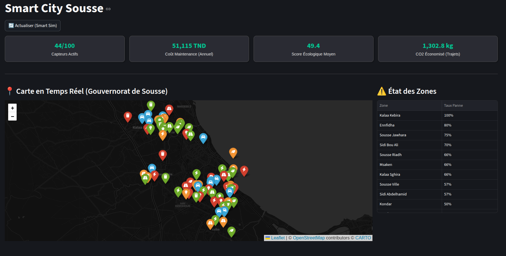

# Smart City Sousse 2030

An academic database project for smart city development in Sousse, Tunisia. This project implements a comprehensive system for real-time simulation, data management, and dashboard visualization to support urban planning.



## Key Features

*   **Real-time Simulation**: Simulates dynamic city events including traffic flow, sensor status updates, and emergency interventions.
*   **Interactive Dashboard**: Visualizes data through a comprehensive Streamlit interface with map integration and real-time metrics.
*   **Data Management**: Robust database schema designed to handle complex urban data models including sensors, vehicles, and citizens.
*   **Analytics**: Provides insights into pollution levels, infrastructure availability, and citizen engagement scores.

## Analytics & Monitoring

The system includes detailed analytics views to monitor specific city domains:


## Quick Start

### Prerequisites
*   Python 3.7+
*   MySQL, PostgreSQL, or SQLite

### Installation

1.  **Clone the repository**
    ```bash
    git clone https://github.com/OussemaBenAmeur/smart-city-sousse-2030.git
    cd smart-city-sousse-2030
    ```

2.  **Install dependencies**
    ```bash
    pip install -r requirements.txt
    ```

3.  **Initialize Database**
    ```bash
    # Using SQLite for quick setup
    sqlite3 smartcity.db < schema.sql
    ```

### Running the Application

1.  **Start Data Simulation**
    ```bash
    python simulate_realtime.py
    ```

2.  **Launch Dashboard**
    ```bash
    streamlit run dashboard.py
    ```

## Project Structure

```text
smart-city-sousse-2030/
├── smartcity_backend/      # Backend logic and API
├── dashboard.py            # Streamlit dashboard application
├── simulate_realtime.py    # Real-time event simulator
├── generate_data.py        # Synthetic data generator
├── schema.sql              # Database schema definition
├── assets/                 # Project images and resources
└── captures/               # Raw screenshots
```

## Authors

*   **Yacin Ben Kacem** ([@YACINBK](https://github.com/YACINBK))
*   **Oussema Ben Ameur** ([@OussemaBenAmeur](https://github.com/OussemaBenAmeur))

---
*This is an academic project developed for the Smart City module.*
