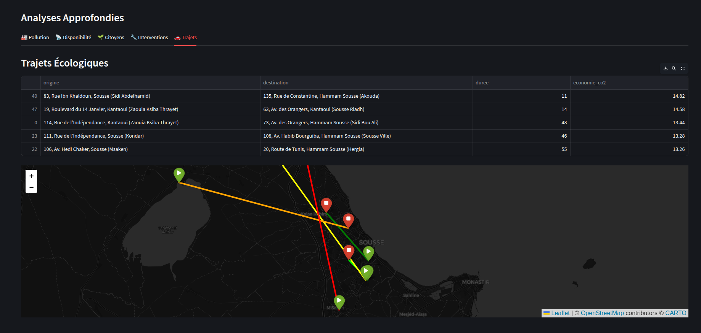
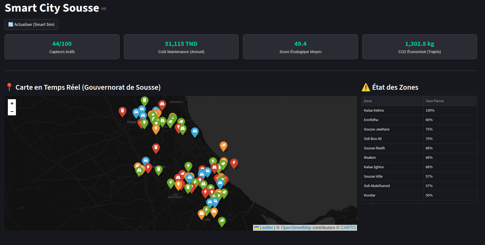
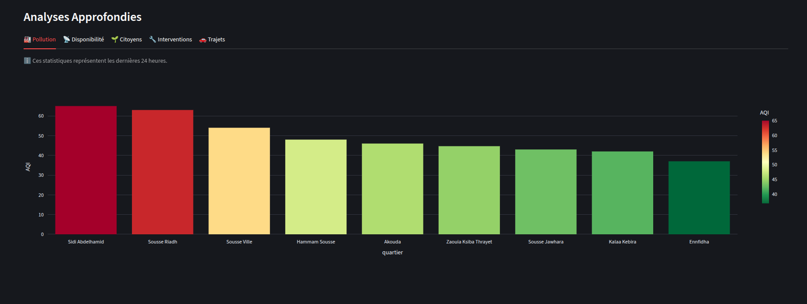

# Smart City Sousse 2030

Smart City Sousse 2030 is an academic project developed for a databases course. It models a smart-city platform for the governorate of Sousse with a relational backend, a REST API, synthetic urban data, a Streamlit dashboard, and a real-time simulation loop.

The project focuses on database-driven supervision of:

- connected urban sensors
- maintenance interventions
- citizens and public consultations
- autonomous vehicles and ecological trips

## Project Goals

- design a coherent relational data model for a smart-city scenario
- expose the data through a reusable Django REST API
- simulate operational events such as sensor failures, repairs, and trips
- visualize indicators through an interactive dashboard

## Technology Stack

- Backend: Django, Django REST Framework
- Dashboard: Streamlit, Plotly, Folium
- Database: SQLite by default
- Data generation: Faker + custom Tunisian/Sousse-oriented generators

## Implemented Improvements

This refactor cleaned and strengthened the project in several areas:

- centralized duplicated district and simulation logic into shared backend services
- cleaned the Streamlit dashboard and made API access more robust
- added model ordering, indexes, and integrity constraints for better database quality
- fixed test discovery side effects caused by `test_debug.py`
- replaced placeholder tests with real backend and API tests
- improved Django admin configuration for easier inspection of course data
- simplified data generation so the standalone script uses the Django management command
- corrected the launcher so it runs migrations without generating accidental new ones
- updated project settings to better match the local context (`fr-fr`, `Africa/Tunis`)

## Screenshots

### Dashboard Overview


### Analytics View



### Additional Captures





## Data Model Overview

Main entities:

- `Proprietaire`: owner of sensors
- `Capteur`: smart-city sensors with location, type, and status
- `Technicien`: maintenance staff
- `Intervention`: predictive, corrective, or curative maintenance operations
- `Citoyen`: residents with mobility preferences and ecological score
- `Consultation`: public consultation projects
- `Participation`: many-to-many relation between citizens and consultations
- `VehiculeAutonome`: autonomous or electric vehicles
- `Trajet`: trips linked to vehicles with CO2 savings

Database-quality improvements added in this refactor:

- indexes on frequently queried fields such as sensor status, district, intervention type, and consultation status
- uniqueness constraints on participation and technician assignment tables
- validation preventing invalid consultation date ranges

## Project Structure

```text
smart-city-sousse-2030/
├── dashboard.py
├── generate_data.py
├── launch.sh
├── manage.py
├── simulate_realtime.py
├── requirements.txt
├── assets/
├── captures/
└── smartcity_backend/
    ├── settings.py
    ├── urls.py
    └── api/
        ├── admin.py
        ├── constants.py
        ├── models.py
        ├── serializers.py
        ├── services.py
        ├── tests.py
        ├── urls.py
        └── views.py
```

## Installation

### 1. Clone the repository

```bash
git clone https://github.com/OussemaBenAmeur/smart-city-sousse-2030.git
cd smart-city-sousse-2030
```

### 2. Create and activate a virtual environment

```bash
python3 -m venv venv
source venv/bin/activate
```

### 3. Install dependencies

```bash
pip install -r requirements.txt
```

### 4. Apply migrations

```bash
python manage.py migrate
```

### 5. Generate synthetic data

```bash
python generate_data.py
```

## Running the Project

### Option 1: Start each service manually

Start the backend:

```bash
python manage.py runserver
```

In another terminal, start the Streamlit dashboard:

```bash
streamlit run dashboard.py
```

Optional: start the continuous simulator in a third terminal:

```bash
python simulate_realtime.py
```

### Option 2: Use the launcher script

```bash
chmod +x launch.sh
./launch.sh
```

The launcher:

- activates or creates the virtual environment
- installs dependencies if needed
- applies migrations
- starts Django
- starts the simulator
- starts the Streamlit dashboard

## Default Local URLs

- API root: `http://127.0.0.1:8000/api/`
- Django admin: `http://127.0.0.1:8000/admin/`
- Dashboard: `http://127.0.0.1:8501/`

## API Endpoints

The REST API exposes the following resources:

- `/api/proprietaires/`
- `/api/capteurs/`
- `/api/techniciens/`
- `/api/interventions/`
- `/api/citoyens/`
- `/api/consultations/`
- `/api/vehicules/`
- `/api/trajets/`
- `/api/simulate/` for a one-step simulation trigger

## Testing

Run the backend checks:

```bash
python manage.py check
```

Run the automated tests:

```bash
python manage.py test
```

The current test suite covers:

- model validation rules
- simulation service behavior
- API serialization and simulation endpoint responses

## Academic Value

This repository is suitable for a databases course because it demonstrates:

- entity design with multiple relationships
- many-to-many tables with semantic roles
- indexed fields for common queries
- data integrity constraints
- API exposure of a relational schema
- use of generated data to validate the model in practice

## Suggested Next Improvements

The following would be good next steps if the project is extended further:

- add authentication and role-based permissions for admin, technician, and dashboard users
- separate development and production settings
- add filtering and pagination to the API endpoints
- persist time series for sensor readings instead of simulating only status changes
- add a formal ER diagram and SQL query examples in the course report

## Authors

- Yacin Ben Kacem
- Oussema Ben Ameur

## License

This repository is provided for academic use.
